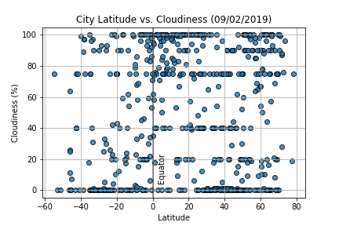
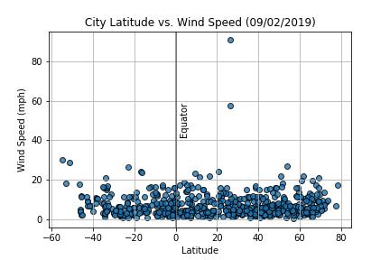

# What's the Weather Like?

### Background

Python script was created to visualize the weather of 500+ cities across the world of varying distance from the equator using [CityPy](https://pypi.python.org/pypi/citipy), a simple Python library, the [OpenWeatherMap](https://openweathermap.org/api) API, and JSON traversals to answer a fundamental question: "What's the weather like as we approach the equator?"

### WeatherPy

To answer the above question, a series of scatter plots were visualized to showcase the following relationships: 

* Temperature (F) vs. Latitude

* Humidity (%) vs. Latitude

* Cloudiness (%) vs. Latitude

* Wind Speed (mph) vs. Latitude

The python script accomplishes the following:

- Randomly selects at least 500 unique (non-repeat) cities based on latitude and longitude.
- Performs a weather check on each of the cities using a series of successive API calls.
- Includes a print log of each city as it's being processed with the city number and city name.
- Saves both a CSV of all data retrieved and png images for each scatter plot.

## Observable Trends

* Not surprisingly, temperature increases as we approach the equator. However, the weather in cities closest to the equator is not necessarily the warmest, temperature is higher on cities that are closer to the equator along the latitudes of -35 and 30. This may be due to the Earth's tilt in the axis known as obliquity.

* Wind speed tends to generally be between 0 and 20 mph regardless of latitude.In addition, it appears to slightly increase as we move away from the equator.

* There is no strong relationship to latitude between humidity and cloudiness. The visualizations above show a great variety of values at similar latitudes.
